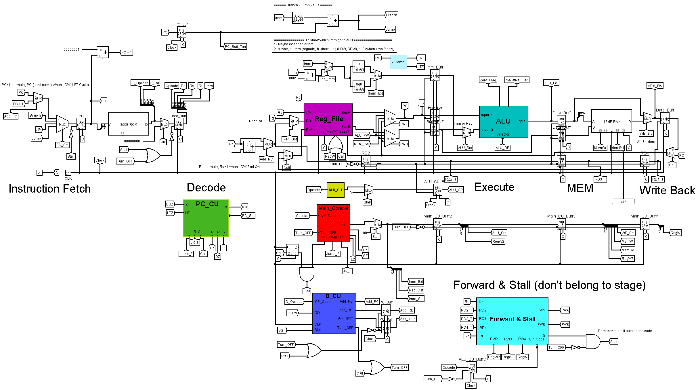

# Pipelined CPU - Verilog HDL

A 32-bit 5-stage pipelined RISC processor built and simulated using Logisim and Verilog HDL. This project implements a simplified custom ISA and verifies correct operation through simulation and waveform analysis.

---

## Table of Contents
- [Project Implementation](#project-implementation)
- [Project Overview](#project-overview)
- [CPU Screenshot](#cpu-screenshot)
- [Repository Structure](#repository-structure)
- [Instruction Set Architecture](#instruction-set-architecture)
- [Pipeline Stages](#pipeline-stages)
- [Features](#features)
- [How to Run](#how-to-run)
- [Simulation Results](#simulation-results)

---

## Project Implementation

The project was successfully simulated and create a fully functional CPU using logisim with `.hex` file format, then the same Data path was translated to `HDL` using `verilog` and `Active HDL` IDE to complete testing the function more deeply.

---

## Project Overview

This project aims to design and verify a simple 32-bit pipelined RISC processor with the following pipeline stages:
Instruction Fetch (IF), Instruction Decode (ID), Execute (EX), Memory Access (MEM), and Write Back (WB).

The processor supports:
- 16 general-purpose 32-bit registers (R0–R15)
- A separated instruction and data memory
- Sign-extension or zero-extension for immediate values
- A full forwarding and hazard detection unit

---

## Repository Structure

```
├── PipelinedProcessor.v         # Top-level processor integration
├── ALU.v, RegisterFile.v       # Core computation and storage units
├── IF_stage.v to WB_stage.v    # Each pipeline stage as a module
├── Control_Unit.v              # Main control unit and logic
├── Forwarding_Unit.v, Hazard_Unit.v # Pipeline hazard management
├── Instruction_Memory.v, Data_Memory.v
├── test_PipelinedProcessor.v   # Testbench
├── Instructions.txt            # Input program
├── CPI_Img.png                 # Waveform or CPI chart (see below)
└── Project_Document.pdf, Project_Report.pdf
```

---

## CPU Screenshot
A screen shot that show the entire CPU Simulation


---


## Instruction Set Architecture

Instructions format:
```
Opcode(6) | Rd(4) | Rs(4) | Rt(4) | Imm(14)
```

Supported 15 instructions using 6-bit opcodes:
- R-type: `OR`, `ADD`, `SUB`, `CMP`
- I-type: `ORI`, `ADDI`, `LW`, `SW`, `LDW`, `SDW`
- Branching: `BZ`, `BGZ`, `BLZ`
- Control flow: `JR`, `J`, `CALL`

---

## Pipeline Stages

Each instruction passes through:
1. **IF**: Fetch from instruction memory
2. **ID**: Decode instruction, generate control signals, detect hazards
3. **EX**: ALU operation
4. **MEM**: Load/store to data memory
5. **WB**: Write result back to registers

Hazards are resolved using a Forwarding Unit and Stall/Kill control logic.

---

## Features

- Custom ISA
- Forwarding for RAW hazards
- Stalling and control hazard management
- Dual-memory architecture
- Support for double word load/store with hazard awareness
- Exception handling for LDW/SDW if misaligned

---

## How to Run

1. Edit `Instructions.txt` with your program in binary or hex format.
2. you can convert your instructions from `Assembly` to `HEX` format using `instructions_converter.py`
3. Compile all modules with your preferred simulator (ModelSim/Active-HDL).
4. Run `test_PipelinedProcessor.v` to validate outputs.
5. View waveforms and verify correct pipeline execution.

---

## Simulation Results

Simulation tests include:
- Loops with LDW/SDW hazards
- Nested loop testing and verification of register/memory contents
- Function call and return using `CALL` and `JR R14`
- Duplicated arrays detection and conditional store behavior

Waveforms and results are shown in the report and documented in images.

---
